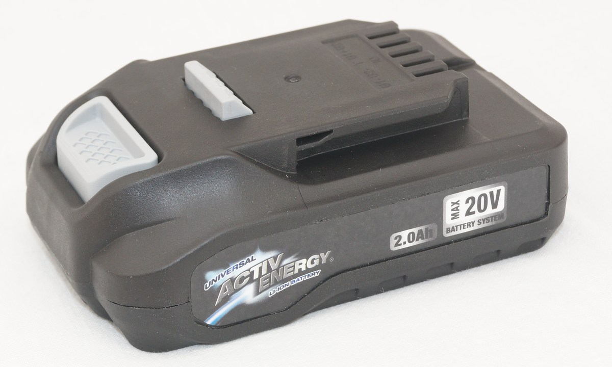
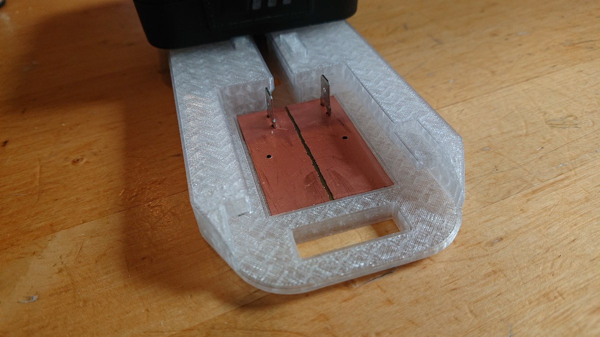
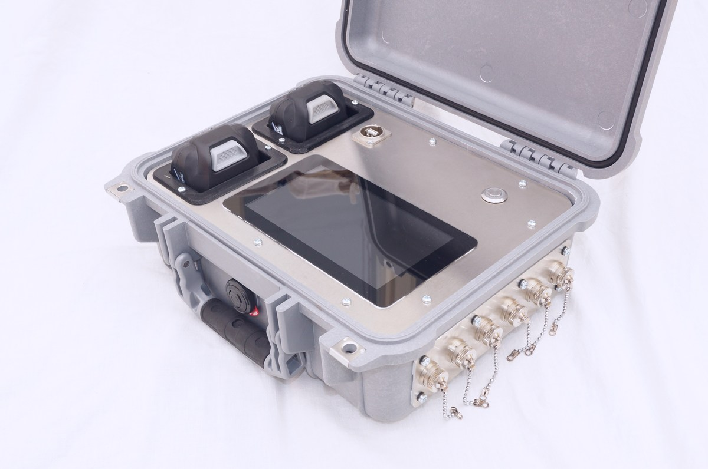

Batteriehalter für ActivEnergy Akkus vom Hofer/Aldi
===================================================

# Es gibt hier 3 Varianten
1. Einzelhalterung
2. Doppelhalterung
3. Schale für Panelmontage

Das Repo enthält die FreeCAD-Dateien, STL-Dateien zum direkten Drucken und eine Bohrschablone für die einzuklebende Leiterplatte. 

Als Kontakte werden Faston-Tabs 6.3mm von Reichelt verwendet: Bestellnummer "VT FS-P 6,35", Hersteller: Vogt ArtNr 03866.A68

 

 

# Lizenz
Copyright: Karl Zeilhofer 2021  
Alles unterliegt der MIT-Lizenz, ist also zur freien Verwendung in jeglichen Projekten gedacht. 

Happy Hacking!
